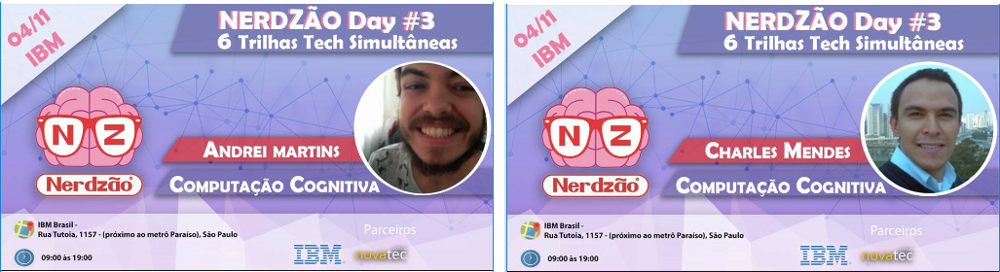

# Introdução à Mineração de Texto
Palestra no [evento Nerdzão](https://www.meetup.com/pt-BR/Nerdzao/events/242381283/) na IBM Brasil, falando "Introdução à Mineração de Texto".

## Falamos sobre

- Tokenização;
- Bag of words;
- Stop words;
- Nuvens de palavras (wordclouds)
- Análise de Sentimento
- Frequência das Palavras (TF)
- Freqüência Inversa no Documento (IDF)
- Ponderação TF-IDF
- N-grama (Bigrama)

## Apresentação Slide

- [Introdução à Mineração de Textos - By Andrei Martins e Charles Mendes]

## Referências

- [Cliente R para API do Twitter](https://github.com/mkearney/rtweet)
- [Text Mining With R](http://tidytextmining.com/)